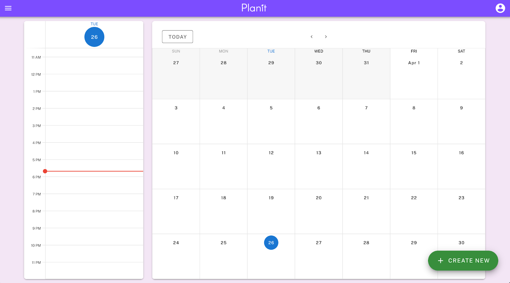
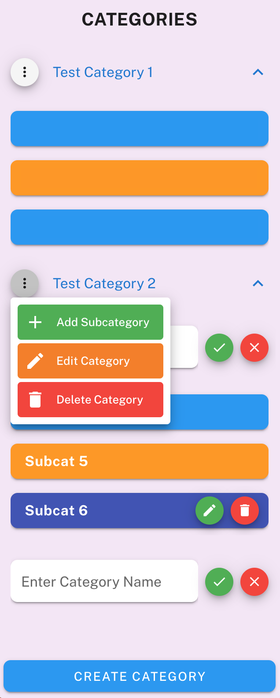
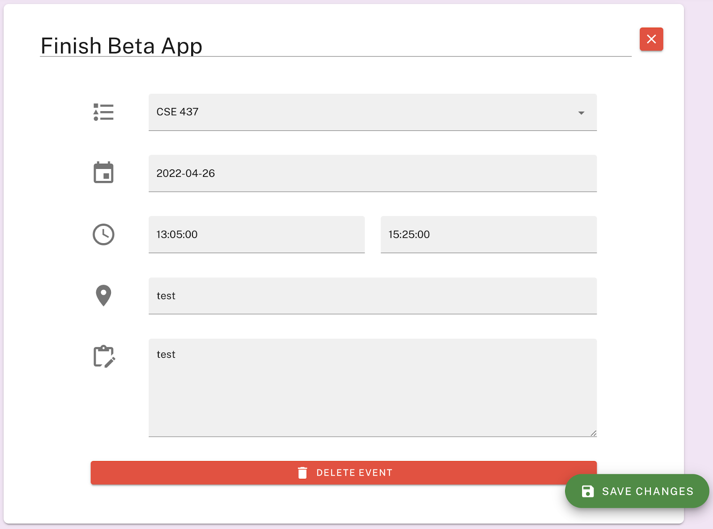

# Planit Productivity App

_\#Vuetify \#VueJS \#Flask \#SQLAlchemy_ 

**Created with Carmen Yip \(@imcalledmichaela\) and Noah Li Anderson \(@nlanderson-wustl\)**

Productivity App created for Software Engineering Class

> [!IMPORTANT]
> The app does not work now, as the backend servers are down. Please refer to screenshots for what Planit Looks like.

## Premise
We felt that existing calendaring apps (at the time) are very complicated to use, or would take some configuring to show directly to the user what tasks they have up next. Instead of focusing on event management, PlanIt seeks to focus more on task planning and time management.

## Features
1. User account creation to save your own tasks
2. Creating an event vs. creating a task (inputting the amount of time the task will take automatically fills out end time on calendar
3. Organize tasks in categories and subcategories
4. Two calendar views (daily and monthly/weekly) in the same page. 
5. Material Design throughout the entire app

## This Project Showcases:
- 📚 Full stack web development
  - **SQLAlchemy** for the ORM
  - **Flask** for the backend framework
  - **Vue.js** for frontend framework)
- 🏃‍♂️ Agile development with teammates
- 🔍 Attention to detail for spacing for various elements to keep true to the true Instagram post
- 📱 Adaptive to various screen sizes

## My Contributions
- I was responsible for the UI/UX of Planit, signup/login, event creation and update, and categories view.
  
## Screenshots

> Home View

> Categories View

> Event Creation View

## To Improve for V2
- [ ] Recurrences for tasks
- [ ] Sorting options in subcategories view
- [ ] Automatic scheduling of tasks around events with AI

